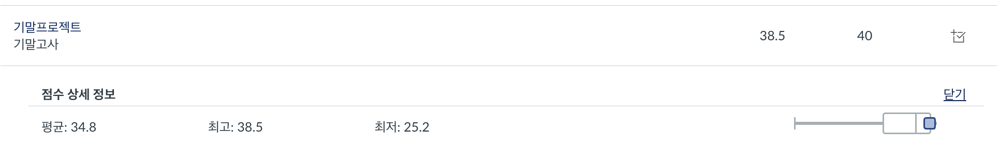
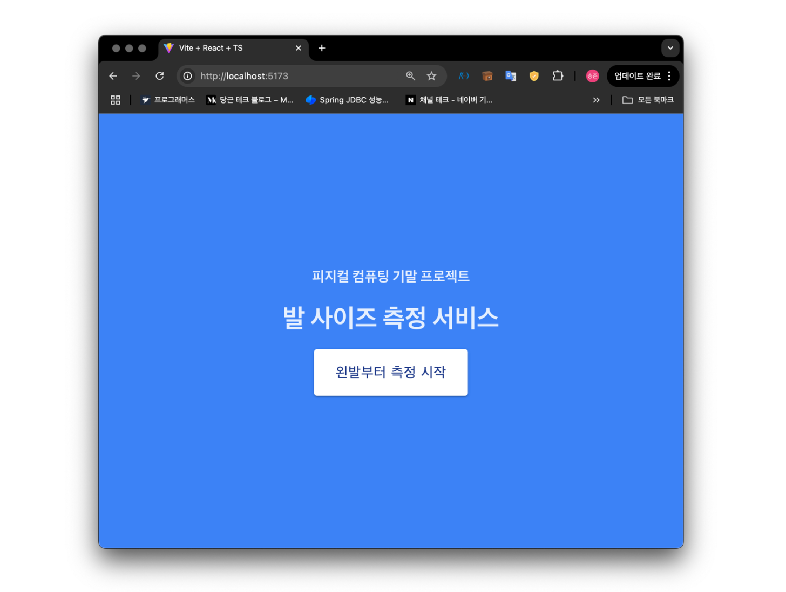
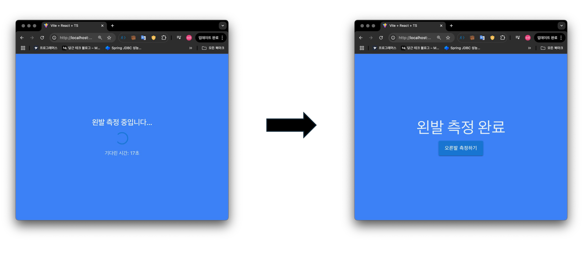
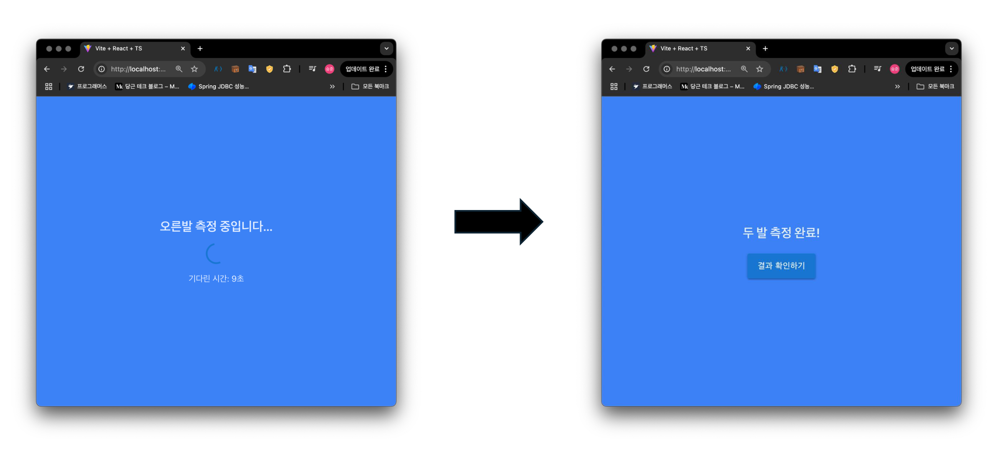
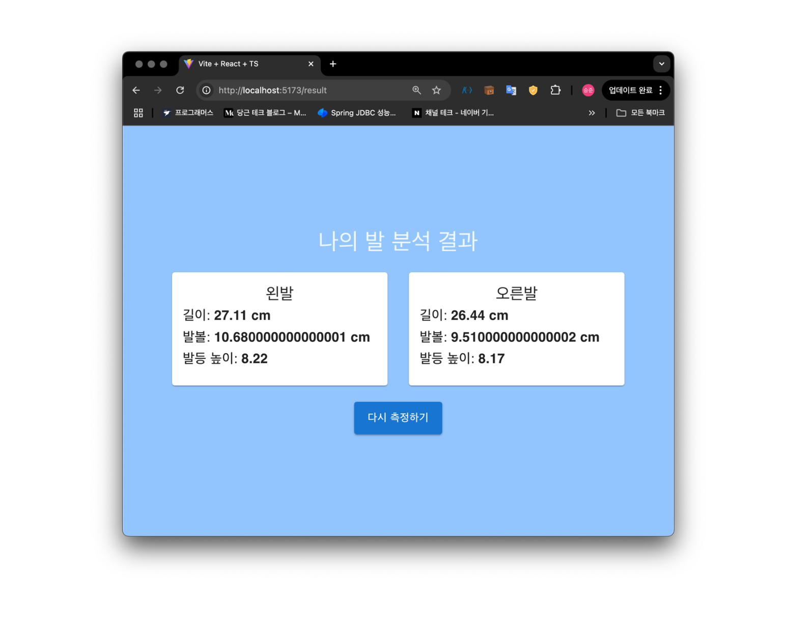

# 3-2 Physical Computing Project

## Project Overview

| Component   | Technology        | Description                                 |
| ----------- | ----------------- | ------------------------------------------- |
| **Arduino** | C++               | 센서 데이터 수집 및 하드웨어 제어           |
| **Server**  | Python            | 데이터 처리 및 클라이언트와의 통신 담당     |
| **Client**  | React, TypeScript | 사용자 인터페이스(UI) 구현 및 데이터 시각화 |

  

## Project Diagram

  
  
  
  

---

### Description

1. **Arduino (C++):**

   - 센서를 통해 실시간 데이터를 수집합니다.
   - 수집된 데이터를 Serial 통신을 통해 서버로 전송합니다.

2. **Server (Python):**

   - Arduino로부터 데이터를 수신합니다.
   - 각 센서당 100개의 샘플링 과정을 거치고 그 중 최솟값을 추출합니다.
   - 데이터 처리를 수행하고 클라이언트로 전송합니다.

3. **Client (React, TypeScript):**
   - 서버에서 전달받은 데이터를 시각적으로 표현합니다.
   - 사용자와의 상호작용(UI) 기능을 제공합니다.
